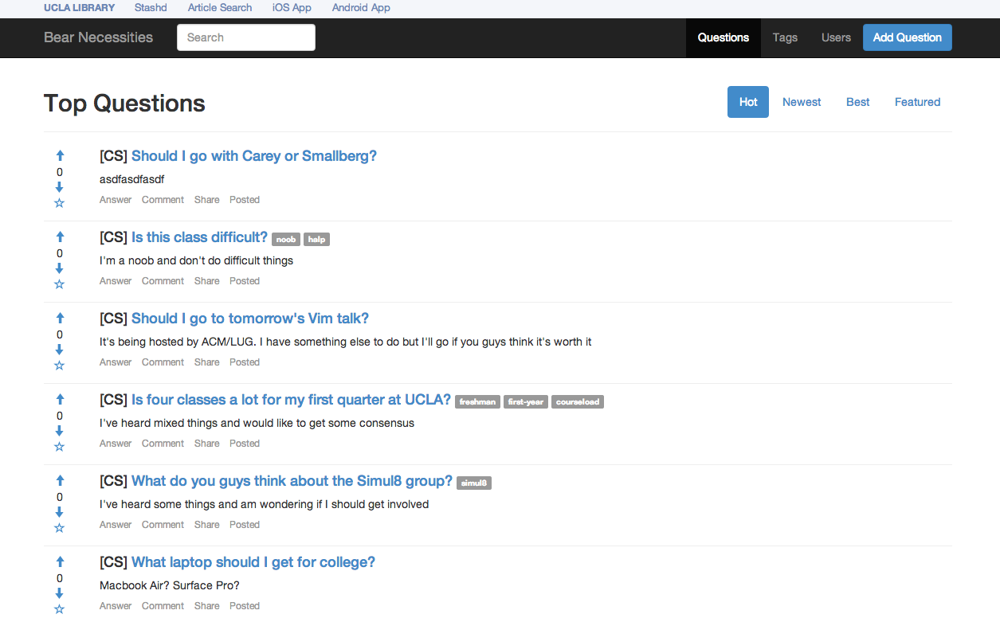

Bear-Necessities
================

Think Stack Overflow for UCLA.

TODO
==========
* make tags comma separated (build the list in realtime (angular?))
* preview question before posting
* [typeahead](http://twitter.github.io/typeahead.js/examples/) for course listing using UCLAAPI
* be able to answer a question
* implement voting
* implement user auth (SSO)
* implement comments
* allow sorting by hot, new, best, featured
* implement reputation schema (look at Stack Overflow, Yahoo Answers)
* Implement sharing (facebook, twitter)
